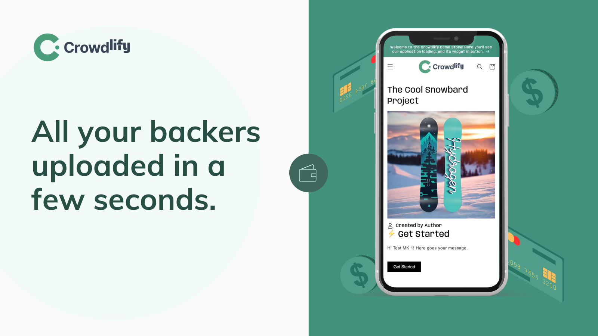
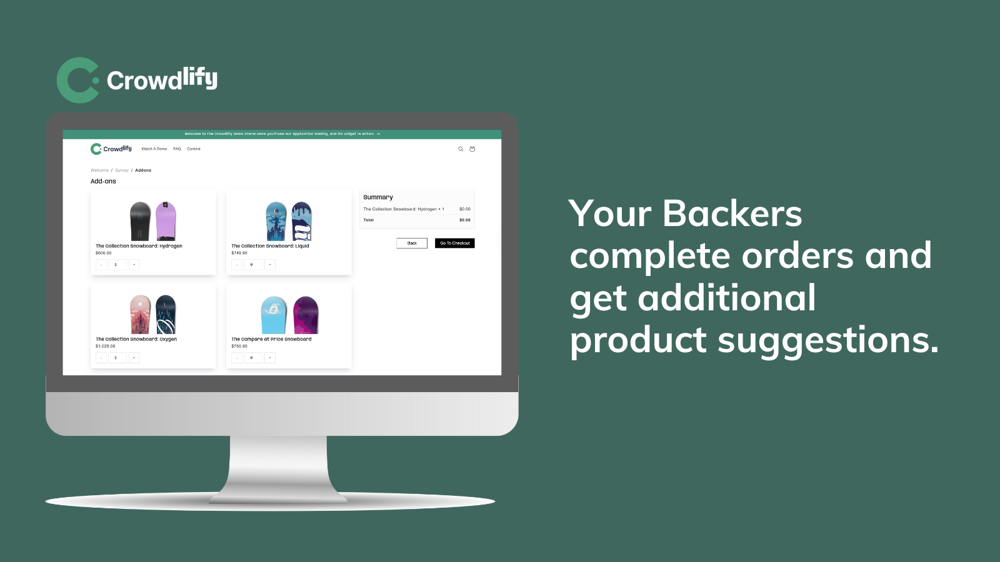
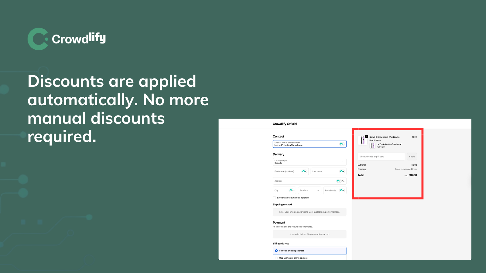
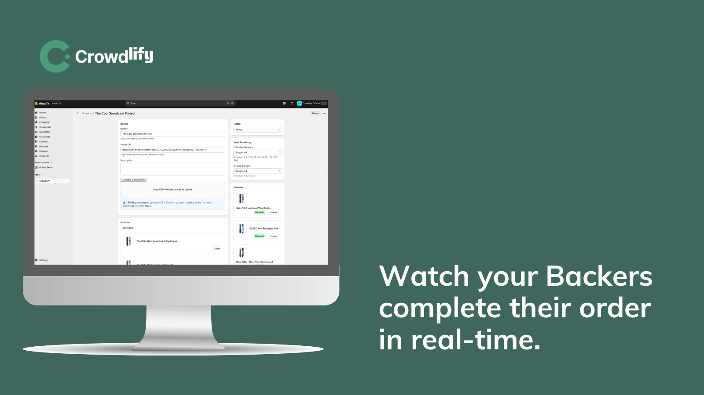

A few years ago, I noticed a pattern with a client I worked with: he ran a successful crowdfunding campaign, raised the money and celebrated… and then chaos started: CSV files with thousands of backers, manual spreadsheets, variant mismatches, backers emailing support, discounts applied incorrectly and fulfillment delayed for weeks. Put all that together with a Shopify integration (because the client has successful Shopify stores), and all the happiness of your campaign disappears quickly.

**_TLDR:_** I built [Crowdlify](https://github.com/jmanzo/crowdlify-official) because of the gap between a successful campaign, stressful operations and Shopify workflow for creators.

## **The Problem:**

Crowdfunding platforms are great at collecting money, and Shopify is great for selling stuff. So, why not combine them? Those platforms are not great at fulfillment, because their mission is just that, collect the money for funding the idea, but not many know that once a campaign ends, creators have to:

1.  Export/import backer data manually
2.  Figure out what was pledged
3.  Collect product selections (sizes, colors, add-ons)
4.  Apply pledge discounts correctly
5.  Prevent double purchases
6.  Handle reminder emails

There are platforms that already help with this. The [bigger one](https://www.backerkit.com/) extracts the creators’ souls, and it is the most expensive one. It is a separate platform, so there is no way for creators to connect their existing Shopify stores and get the full value from it. Sad.

This client specifically was paying enormous fees to some external platforms, and he needed to configure, create Add-ons and add work to his already extenuating journal, anyway.

## **The First Version**

I started a first version of this idea back in 2021, when this client first presented those issues to me. He has successful Shopify stores, with products and real customers that he wanted to connect with the crowdfunding campaigns he was running, so my first instinct was simple:

“Just import backers and generate discounts.”

That sounded straightforward, but it wasn’t.

As soon as I started building, complexity exploded:

-   Backers could have different pledge states.
-   Some had paid, some had errors.
-   Some had bonus support amounts.
-   Shopify products had to be mapped after import.
-   Surveys needed to reflect that mapping dynamically.
-   Discounts had to behave differently depending on pledge status.

And everything had to be multi-tenant, secure, and isolated per shop.

The MVP forced me to confront something quickly:

Fulfillment logic is edge-case hell.

With all this in mind, I ended up choosing the current stack Shopify offered that year to build an initial Custom Private App for this client. It was NextJS v10 then. Horrible, I know. I’m aware that the NextJS team already fixed a lot of issues this framework had back then in [new versions](https://nextjs.org/docs), but at that time, with not too much experience in app development, no AI, and Shopify technical difficulties, it was a nightmare and a real challenge.

Shopify is known in the web development niche for constantly releasing new features, upgrades, and API security patches, and it is great, for sure. But sometimes this frequency is an annoyance for developers. We must upgrade at a faster pace, deprecate features, replace other ones, etc, etc. For a lone developer, this can be stressful, and for a client with a unique application, it can be technically costly, isn’t it?

So, this initial version of the app ended up being deprecated and not maintained appropriately for years. Finally, after 4 years, it was completely abandoned.

Doing some retrospection, I would say that this project died because of some responsabilities i can recall:

-   A wrong infrastructure (the stack wasn’t convenient)
-   A lack of critical features that already exist today
-   Inexperience on my end
-   Some client expectations and timelines
-   The constant rush of the Crowdfunding campaigns forced bad decisions throughout the development
-   Lack of constant maintenance during the years that passed

But this journal is not a bitacora of that old project. I just wanted to be honest and clear about what drove me to develop this external, independent version many years later. I belived on this project. I believed in its great potential. A post-purchase discount handling and fulfillment app is highly useful and appreciated in the Shopify environment, not only for Crowdfunding campaigns but also for other business models (I will talk about this later).

So, 4 years later (September 13, 2025), I started building this version of the app out of my own labour hours as an independent side project: [Crowdlify](https://github.com/jmanzo/crowdlify-official).

## **Technical Decisions:**

I built this application using a special stack:

1.  Remix with React Router,
2.  Prisma for the ORM, and
3.  PostgreSQL (the database).

Internally, it was coded with Typescript, which was great for planning and generating code with AI.

Typescript offers great convenience for AI generation because it’s a typed language, allowing the AI to predict and provide context on its own. It comes with typecheck commands that allow quick testing while generating code live. It’s just outstanding behavior, almost magical.

## **The Real Challenges**

### **1\. Multi-Tenancy Wasn’t Optional**

Every single query must be scoped by the shop. In theory, that sounds obvious, but in practice, it requires discipline in every model, every route, every webhook, every background job. You cannot add multi-tenancy later. It had to be baked into the architecture from day one.

That shaped the entire data layer.

### **2\. CSV Imports Were a Minefield**

Crowdfunding platform exports (like [Kickstarter](https://www.kickstarter.com/) and [Indiegogo](https://www.indiegogo.com/)) are messy.

-   Large files (up to 10MB)
-   Different encodings
-   Inconsistent reward naming
-   Products as columns, not rows. But sometimes, as rows or inside the cell
-   Mixed payment states
-   Different formats and structures

Imports can’t block the request cycle. They have to run as background jobs.

They also had to be idempotent.

Re-importing shouldn’t corrupt data.

Webhooks shouldn’t double-process orders.

That’s where strict status mapping became critical, with _collected_ and _errored_ statuses.

Clear separation prevented many subtle bugs.

### **3\. Discount Automation Is Trickier Than It Sounds**

Discount logic had to:

-   Apply 100% discounts for pledged products (if payment _collected_)
-   Apply bonus support discounts for _errored_ payments
-   Handle add-ons separately
-   Prevent double-discount if already purchased
-   Respect Shopify’s cart transform rules. The old version used manual discounts created directly during checkout via the Admin GraphQL API (horrible, but Shopify Functions didn’t exist at the time).

My goal was to encode business rules inside a deterministic system that cannot afford ambiguity. And that was Shopify Functions via [the Cart transform](https://shopify.dev/docs/api/functions/2025-10/cart-transform) operations. Also, I didn’t want to mix with manual or smart discounts.

### **4\. UX Simplicity Requires Brutal Constraints**

One of the most important decisions was what **not** to build.

-   No UI listing all surveys (performance risk at scale) \*
-   No manual “mark complete”. Merchant (creators) must not worry about this at all.
-   No editing surveys after import \*
-   No deleting individual surveys \*
-   Re-import the CSV instead
-   Use the [Polaris Web Components](https://shopify.dev/docs/api/pos-ui-extensions/2025-10/polaris-web-components) as suggested by Shopify. A goal is to apply for [Built For Shopify](https://shopify.dev/docs/apps/launch/built-for-shopify) status in the future.

_\* For now. It’s in the feature calendar to be implemented soon._

At first, this felt restrictive.

But constraints protect systems for now.

Every manual override becomes a future support ticket for my newest version.

[Crowdlify](https://github.com/jmanzo/crowdlify-official) wasn’t designed to be flexible at the cost of stability. I wanted it to be predictable.

## **My Hardest Lesson**s

Automation forces clarity because you cannot automate a messy mental model. You must figure out the algorithm and processes first thing.

If a rule or process isn’t clearly defined, you’ll discover it when it breaks or makes an expensive error.

[Crowdlify](https://github.com/jmanzo/crowdlify-official) forced me to formalize things that merchants usually keep vague:

-   What exactly counts as “payment collected” or “errored”?
-   When does a survey become complete?
-   How specifically display Add-ons to the backers to encourage them to purchase more?
-   What happens if a backer checks out twice?
-   What if they purchase differently or outside the survey they received?
-   What if inventory changes mid-survey?
-   How to avoid high spam rates from email providers when sending email reminders daily?

Every ambiguity becomes a bug in production. So, yes: **building this made me more precise as a developer**.

## **Did I use AI**?

I did. It doesn’t matter how much you try to hide it or deny it anyway. It’s the present and the future; we all must adapt and be able to increase our productivity and effectiveness by 10x or 100x. It’s our DUTY as professionals.

The only difference was the structured process I followed to resolve new features and bugs.

As a Typescript developer, I knew pretty well the code I was generating with Cursor. I code-reviewed, checked plans, provided extensive and related context, and more. AI has made me a 10x or 100x developer, compared to what I was before.

I believe it isn’t fair for clients, users, and people worldwide not to benefit ASAP from solutions and software that can be developed and implemented faster nowadays.

Do it professionally, carefully, and thoughtfully. That’s all. Everything is gonna be all right.

## **What Crowdlify Is Today**

[Crowdlify](https://github.com/jmanzo/crowdlify-official) does five things well:

1.  Imports backers safely.
2.  Collects reward selections via a multi-step survey.
3.  Applies pledge discounts automatically.
4.  Sends reminders based on payment state.
5.  Marks completion when orders are placed.

It doesn’t try to replace Shopify.

It doesn’t try to be a crowdfunding platform.

It doesn’t try to be a CRM.

It handles the messy bridge between campaign and fulfillment.

Actually, IT IS a beautiful bridge built between both.

## **What’s Next**

The focus now isn’t on adding features. My focus now will be on:

-   Listening and supporting users.
-   Improving survey performance at scale.
-   Maintaining and fixing potential unexpected bugs.
-   Refining discount edge cases.
-   Improving the deliverability of reminder emails.
-   And most importantly: Reaching out to new potential users who might need my solution to fix their lives.

Reliability > expansion.

## **Closing Thought**s

Building [Crowdlify](https://github.com/jmanzo/crowdlify-official) taught me a lot, but something simple:

> The unglamorous parts of software are often the most important.

The truth is that most software problems require responsibility and a structured algorithm or process to rely on. When a campaign ends, creators are holding money that isn’t really theirs yet. It represents expectations. Promises. Deadlines. Backers waiting. Why not fulfill these expectations and promises, wait with an ordered process, and earn more in the middle?

If [Crowdlify](https://github.com/jmanzo/crowdlify-official) does its job well, creators won’t have to worry about the stress after a successful campaign. Backers won’t notice it and will get their reminders to collect the required data. Orders will just flow, discounts will just apply, and surveys will just be completed.

There’s something deeply satisfying about building that kind of boring software.

Not loud.

Not trendy.

Not glamorous.

Just solid.

And for now, that’s enough for me.

Thanks for reading 🙂
