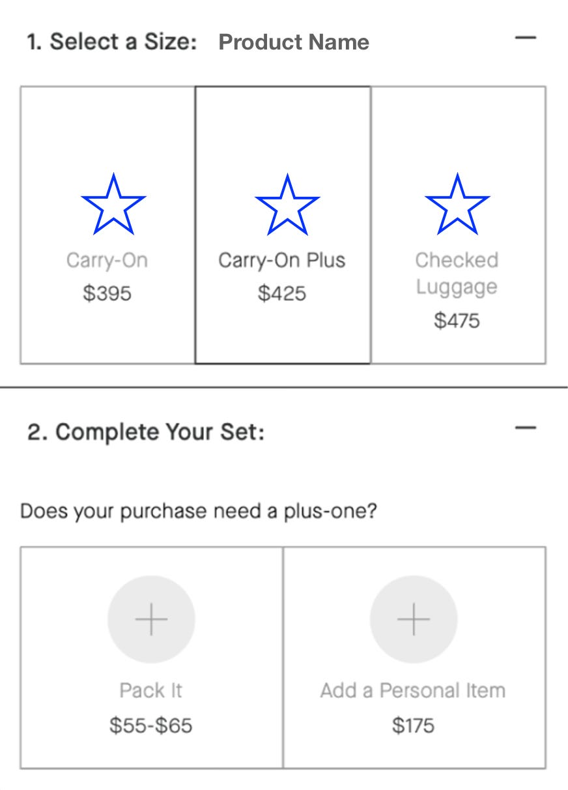
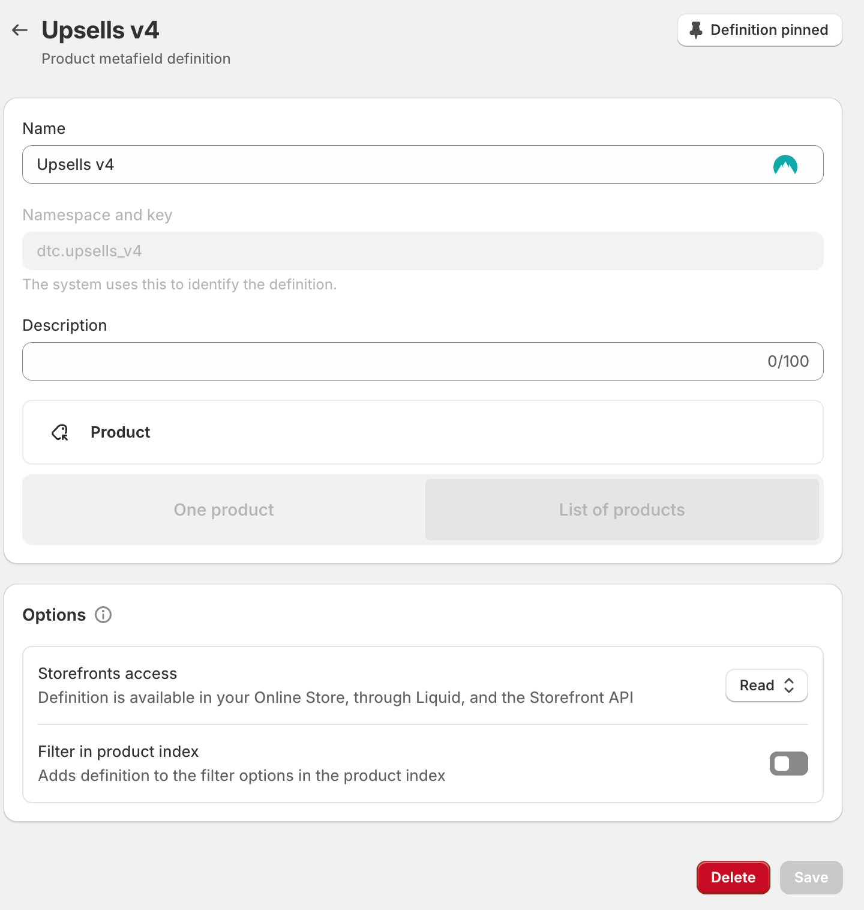
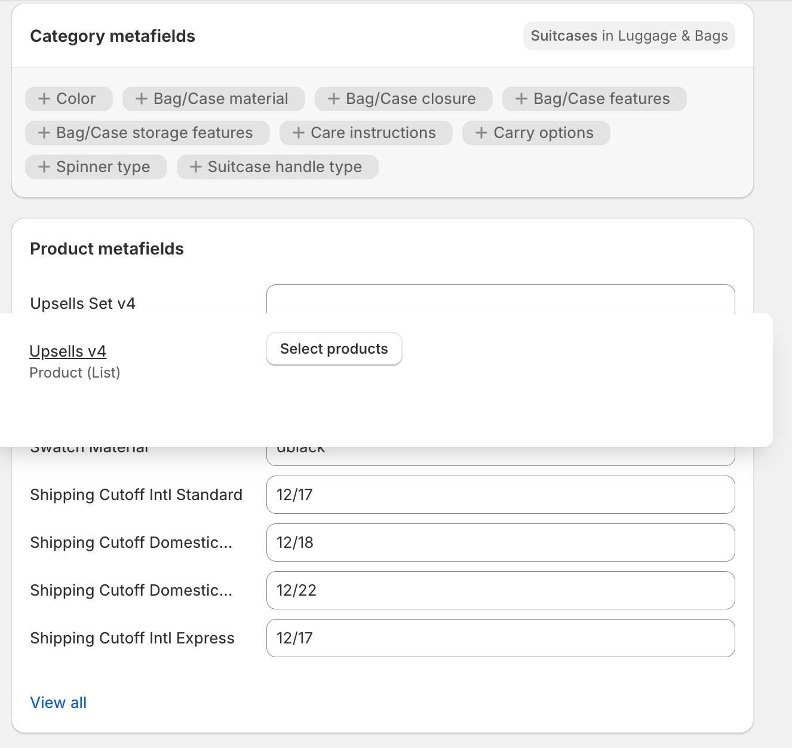
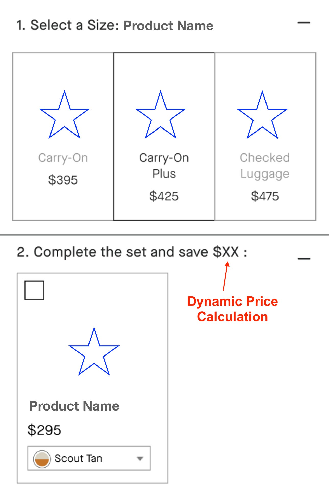

Have you ever stumbled upon a product recommendation on an e-commerce site that felt like it was reading your mind? That’s not magic. Recently, I worked on a Conversion Rate Optimization assignment that involved revamping a “**Complete Your Set**” feature for a Shopify Store. It was a fascinating journey of coding, problem-solving, and ultimately enhancing user experience. Let me take you behind the scenes of this development journey.

## Story

### The Challenge

[Victor Paytuvi, one of our amazing CRO specialists](https://www.linkedin.com/in/victorpay/) in the company I work for ([DTC Pages](https://dtcpages.com/)), conducted a study and evaluation of the “Complete Your Set” original feature, and he realized that _**it was functional but far from optimal**_. The original feature suggested additional products to customers based on their current selections, aiming to increase the average order value. However, the logic was basic, and the user interface needed a serious makeover.

My task was to rework this feature to make it smarter, more intuitive, and visually appealing.



### The Development Process

#### **Understanding the Code**:

The first step was to dive into the code that was initially created to implement this feature. What components, sections and functionality were triggering the Add To Cart event when the customers purchased an additional set? This information was crucial in developing a more effective recommendation algorithm and feature. There is a saying: _“70% of development time is spent reading other’s code”_, and it was more than true this time (always, as a developer, actually).

#### **Design Overhaul**:

The CRO specialist provided me with the proposed design to be implemented in order to improve the whole customer experience and the purchasing algorithm. After inspecting and understanding the improvement involved, and the approach required from me to start developing, I understood the logic behind and the best way to get the work done.

#### **Code, code, and more code:**

It’s kinda like starting to build a house. You start brick over brick, each over each, until you complete the job.

I was introduced to Web Components a few months ago by this client. It was amazing to know and learn how useful, powerful, and spectacular web development is, which is why I fell in love with this career at first.

It turns out that this client utilizes numerous web components within its logic. So, I first started there, looking into the related Web Component and understanding the structure that controlled this feature.

#### **How the whole code looks like:**

What you can see in the code above are snippets that were added to create the variant in the Product Page Template. As you will realize, there is another snippet being called `dtc-complete-set-rework` on line 8 of _**product-form.liquid**_ file, which corresponds to the original section. And then, below that (line 23), there is a file that contains the component and required code to render the variant, which is called `dtc-complete-set-rework-v4`.

There is some additional CSS code that was added to it, but I won’t share it here since it is irrelevant. I said that because the CSS code is pretty much attached to the specific needs of your implementation and designs. Same for Javascript in this case, because the implementation already existed, and just needed a few modifications.

#### **Technical/Backend Shopify Data:**

To get this done, I added 1 more metafield for Products in the Shopify Admin panel. You would find this going through _**Products → Your product → Metafields**_ section at the bottom, or you can _**Settings → Custom data → Products**_. The metafield was called `dtc.upsells_v4`:



Metafields definition panel inside the Shopify Admin.

_This metafield contains a List of products that the user can set in the Shopify Product Panel:_



Product screenshot at the metafields section.

#### **A/B Testing**:

To ensure the changes were effective, we conducted A/B testing. Half of the visitors saw the old “**Complete Your Set**” feature, while the other half experienced the new version.

To display the new version (**Complete Your Set v4**), we used [Convert App](https://app.convert.com/), which allows us to create _A/B variations with CSS or JS code_. It’s a simple but effective app. The following code was used to display variation:

```
.dtc-complete-set-rework-v4 {
  display: block !important;
}

.dtc-no-complete-set-rework {
  display: none !important;
}

span.price-item.price-item--compare.js-upsell-compare-price {
  color: grey;
  text-decoration: line-through;
  font-size: 15px;
}
```

The results were clear—the new feature significantly increased the average order value and user engagement. Final prototype result:



The final prototype result was developed with dynamic price calculation based on variant selection.
