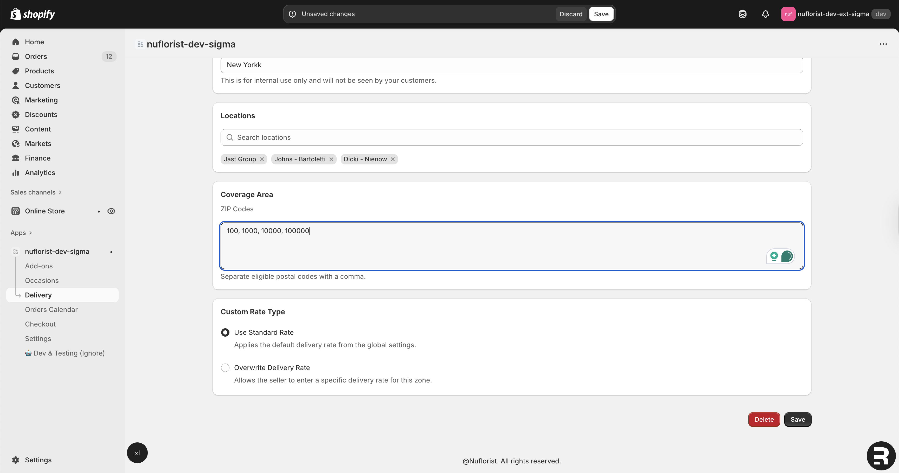
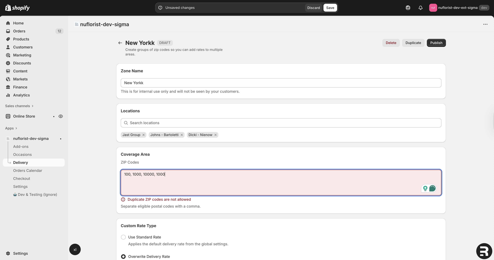
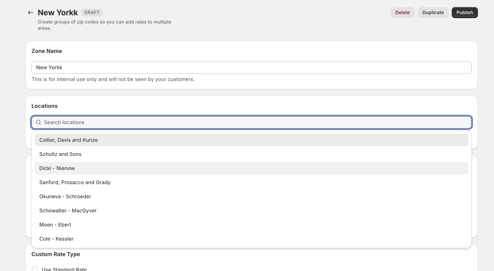
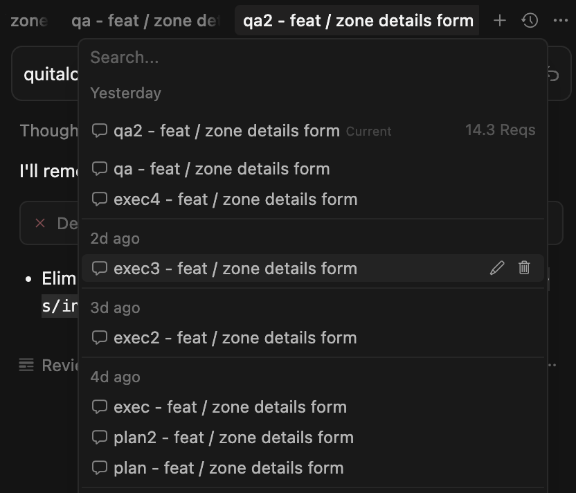
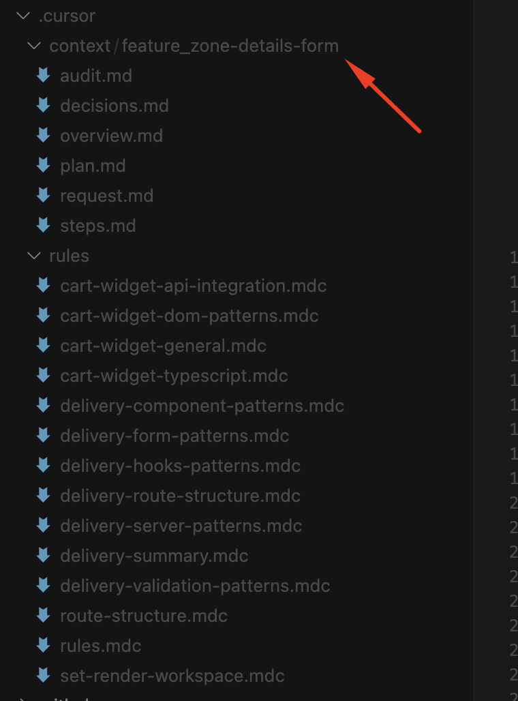
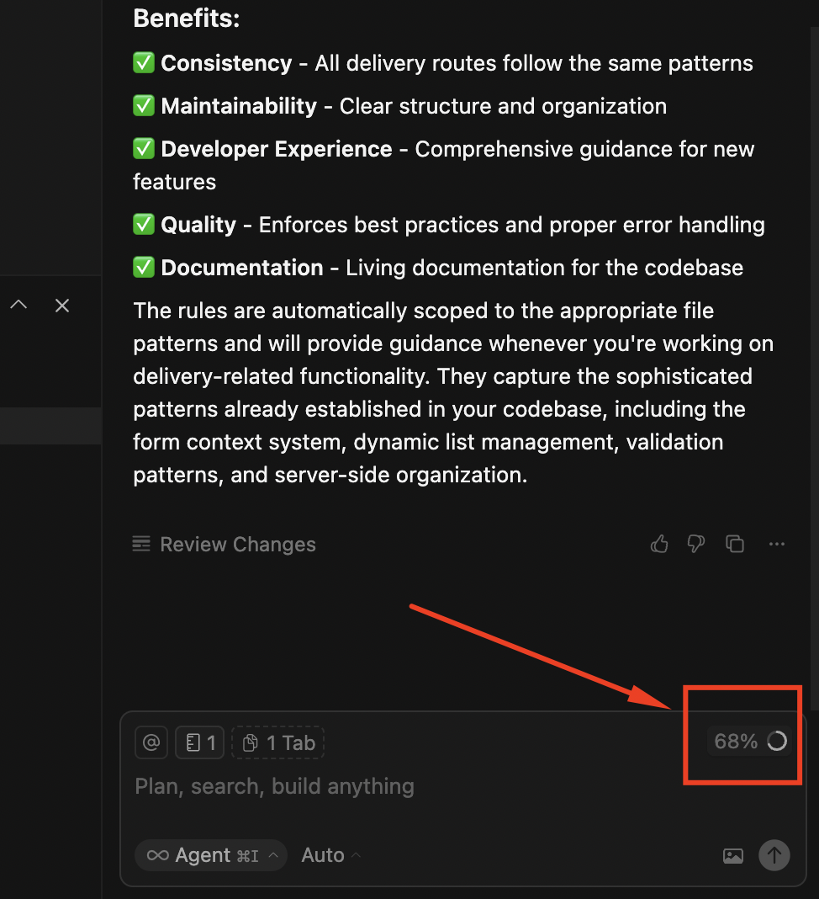

This journal documents a reproducible, phase-driven method I used to design and implement a complex feature, the **Zone Details** form for the Nuflorist Shopify app, using Cursor as my AI pair-programmer. This journal is written with technical rigor so other developers, technical decision-makers, and store owners can quickly understand _how_ I work and _why_ I structure the process this way.

You need features that work, ship fast, and scale without breaking the store, but often, everything either moves too slow, goes over budget, or leaves behind messy code.

That’s where methodology matters.

Recently, I built the **Zone Details Form** for **Nuflorist**, a Shopify app that manages delivery zones. It wasn’t just about writing code; it was about proving that **AI-assisted development** can be precise, auditable, and safe when done with the right workflow. Here’s how I approached it, and how the same approach can benefit you.

## **The Challenge**

The assignment was straightforward in its Acceptance Criteria:

-   Add form fields to create, edit, and publish delivery zones,
-   Validate ZIP codes and avoid duplicates,
-   Manage draft vs. published states,
-   Allow duplication and deletion,
-   Handle pricing overrides with free delivery options.

In practice, this required careful integration with an existing Remix-based Shopify app, following strict standards so the new code wouldn’t “break the vibe” of the project.

## **My Workflow (And Why It Worked)**

Instead of throwing prompts at an AI and hoping for the best, I use a **phase-driven system**.

Here’s a look inside:

### 1\. I structure chats, not endless prompts

Each chat has a name like `plan`\-feature/zone-details-form or dev-`feature/zone-details-form`. This keeps context light, organized, and easy to revisit.

### 2\. Centralized context.

Every assignment gets its own `.cursor/context/` folder with the `request.md` brief, images (Figma or screenshots), and acceptance criteria. This becomes the “single source of truth” for me and the AI.

### 3\. Rules-first, code-second

I make the model analyze existing code first, then generate _rules_ to follow. This avoids spaghetti code, so the new code feels native to the project, and you and your colleagues don’t have to struggle with it xD.

### 4\. Small, readable phase files

Every plan or dev step fits in a markdown file you can read in 1-2 minutes. This is key: it keeps complexity manageable and makes code reviews painless. I’ve already spoken about some of that [advice here](https://jeanmanzo.com/cursor-ai-shopify-whats-worked-for-me-and-hasnt/).

### 5\. Token discipline

I never let a chat exceed ~70% of its token context. If it does, I start a new one. This avoids erratic model behavior (and runaway costs).

### 6\. Step-by-step execution, always human-approved

The AI never runs on autopilot. I check every diff, confirm style, types, and security before committing.

### 7\. Dedicated QA chats

I run a separate qa chat to perform an **AI-powered code audit**: checking for TypeScript errors, security issues, or acceptance criteria gaps. Importantly, the AI doesn’t fix anything here. It just reports to me and dumps its suggestions to an MD file called `audit.md` in the same context’s folder.

### 8\. Final polish and human + Copilot review

Once the QA audit is clean and my own tests confirm functionality, I create the PR and run one last check with GitHub Copilot.

## **Why This Matters for Shopify Entrepreneurs**

You need to care about **speed, quality, and safety**. Here’s how this workflow protects me:

-   **Faster delivery:** Speeds up execution, but it’s managed through systems to keep it under control.
-   **Higher quality:** Every feature undergoes thorough planning, audit, and multiple reviews from me, with no exceptions.
-   **Lower risk:** Explicit rules, context folders, and audits prevent messy surprises and keep everything within a thread I can re-check and follow later. It gives me peace of mind, for sure.
-   **Scalability:** The same workflow applies whether it’s a minor customization or a full app build, but of course, with more complexity, organization, and I don’t know what else :D. I’ll journal it someday if the scope of AI development becomes larger than this.

## **Closing Thoughts**

If you’re scaling or developing a Shopify business or app and you’ve been frustrated with slow dev cycles, unclear code, or high costs, my methodology can be useful. It’s fast, structured, and always under human control. If you have a better one, please let me know. All this AI stuff is new, as I always say, but I cannot stop learning and improving my skills regarding this every day.
