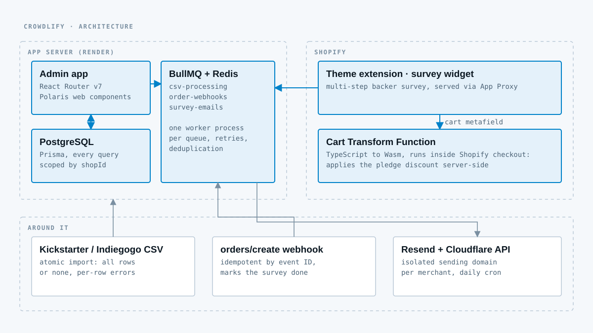

## The problem

A crowdfunding campaign ends and the real work starts. The creator exports a CSV with thousands of backers, each with a different pledge, and now has to collect sizes and colors, sell add-ons, honor what was already paid, and ship. Most do it with spreadsheets and support email. I watched a client go through exactly that, and the store was already on Shopify, so the fix belonged inside Shopify.

## What I built

Crowdlify runs the whole post-campaign flow inside the merchant's store:

1. The merchant uploads the backer CSV from Kickstarter or Indiegogo.
2. Each backer gets a personal survey on the storefront to pick variants and add-ons.
3. At checkout the pledge is honored automatically: a full discount on what was paid during the campaign, or only the bonus-support credit if the campaign payment failed.
4. Backers who haven't finished get reminder emails on a schedule, and the reminders stop as soon as their order comes in.

## Decisions worth explaining

**The discount runs in a Shopify Function, not on my server.** A Cart Transform Function, written in TypeScript and compiled to Wasm, reads the survey payload from a cart metafield and applies the pledge discount inside Shopify's checkout. There is no round trip to the app at the moment a backer pays, so an app outage can't break checkout.

**CSV imports are all or nothing.** A 2,000-row file either imports completely or rolls back with a per-row error report. Half-imported campaigns are worse than failed ones, because nobody can tell which backers are missing.

**Slow work goes through queues.** Three BullMQ queues (CSV processing, order webhooks, survey emails), each with its own worker process, retries and job deduplication. Order webhooks are idempotent by Shopify event ID, so a retried webhook can't mark a survey twice.

**Every merchant sends from their own domain.** The app provisions an isolated sending domain per merchant through the Cloudflare API and Resend, so one merchant's bounces can't hurt another's deliverability.

**Multi-tenant from the first query.** Every database query is scoped by shop, and the daily send limits are tracked per merchant.

## Where it is now

Crowdlify was built, launched and operated with real merchants. It's no longer actively maintained, and the full source is public as an open portfolio project, including the Prisma schema, the workers and the Function.
