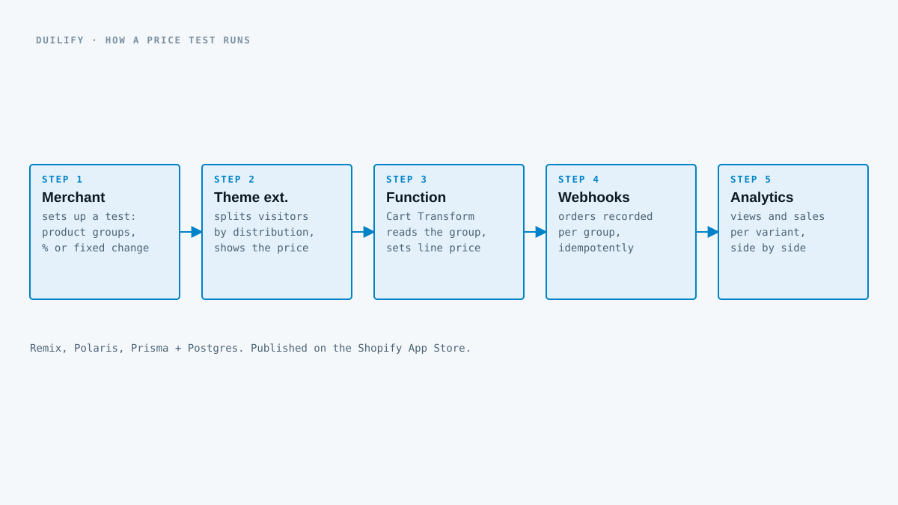

## What it does

Merchants guess at prices. Duilify lets them test instead: create a test, put products into groups, and give each group a percentage or fixed price change. Visitors are split between the groups by the distribution the merchant sets, and the app tracks views and sales for each price side by side.

## How it works

- **Storefront.** A theme app extension assigns each visitor to a group and shows that group's price, with cached price lookups so it doesn't hammer the API.
- **Checkout.** A Cart Transform Function reads the visitor's group from the cart line and the price rules from a variant metafield, and sets the line price inside Shopify's checkout. The price a visitor saw is the price they pay.
- **Results.** Order webhooks, processed idempotently, record sales per group for the analytics view.

The app passed Shopify's App Store review and is listed publicly.

