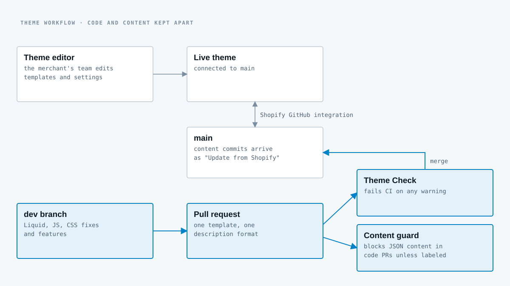

## Context

Marlies Dekkers is a Dutch lingerie and swimwear label with its own Shopify store. The theme already existed when I joined, built on a proprietary agency starter. My job is to keep it healthy and make it better while the store keeps selling: I didn't build it from scratch, and this page doesn't pretend I did.

## What I've done so far

**SEO.** Removed JSON-LD that was being printed twice on every product page, fixed heading semantics (the product-recommendations section now lets editors pick the heading level), and stopped search engines from crawling and indexing the cart.

**Performance.** Responsive `srcset`s everywhere, off-screen hero fetches deferred, and hero carousel videos no longer preloaded for slides nobody has scrolled to.

**Cart and product pages.** Fixed a cart that duplicated its own interface and pushed the page down by 619 pixels, added total-discount display to the cart drawer, reworked the size grid so variant availability and color options stay in sync, fixed the mobile sticky add-to-cart and the quick add-to-cart layout on wide screens.

**Collection pages.** Filter drawer rebuilt for mobile and desktop, with persistent active-filter chips, proper outside-click handling and observers that clean up after themselves, plus a more responsive product grid.

## Keeping code and content apart

The merchant's team edits the store in the theme editor, and Shopify's GitHub integration commits those edits straight to `main`. Code changes from a developer can collide with them. So I set up the repository to keep the two apart:

- Code ships from a `dev` branch through pull requests with one description template.
- **Theme Check** runs in CI and fails the build on any warning. I cleared the existing errors and warnings before raising the bar.
- A **content guard** workflow blocks any pull request that touches templates, settings data, markets or section-group JSON, unless someone explicitly labels it as approved content. Content belongs to the theme editor, not to code PRs.
- A contributing guide and README document the setup, including how preview themes connect through the GitHub integration.
