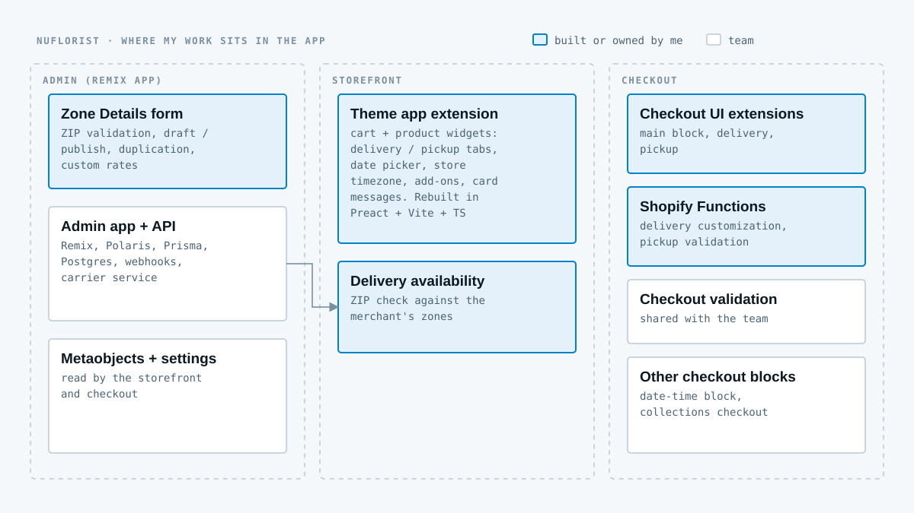

## Context

Nuflorist is a Shopify app for flower shops. A florist doesn't sell like a normal store: every order needs a delivery date, a time window and a ZIP code the shop actually delivers to, or a pickup slot at the store. Card messages and add-ons ride along. Shopify doesn't do any of that out of the box, so the app adds it to the storefront, the checkout and the admin.

It's a team codebase with several developers. I'm not going to claim the whole app, so the diagram below marks what was mine.

## What I owned

**The storefront.** The theme app extension behind the cart and product widgets: delivery and pickup tabs, the ZIP availability check against the merchant's zones, the date picker (including a mobile calendar overlay), times shown in the store's timezone instead of the shopper's, add-ons, and handwritten card messages. I later rebuilt this extension from Liquid and vanilla JavaScript to Preact, Vite and TypeScript. The write-up below covers the result: a bundle roughly 80% smaller, hot reloads under 500 ms and better Lighthouse scores.

**The checkout.** The main checkout UI extension and the delivery and pickup extensions, including billing-address validation, plus two Shopify Functions: delivery customization and pickup validation. The general checkout validation extension I shared with the team.

**The Zone Details form.** In the admin, the form merchants use to define delivery zones: ZIP parsing and live duplicate validation, draft and publish states, duplication and custom rate overrides. I built it phase by phase with AI assistance and reviewed every diff, which is the subject of its own write-up.

## What the team owned

The Remix admin app's core, the data layer and services (Prisma, PostgreSQL, webhooks, the carrier service), and a few checkout blocks such as the date-time block. I worked inside their conventions: Zod validation, typed GraphQL, feature branches with preview environments.
